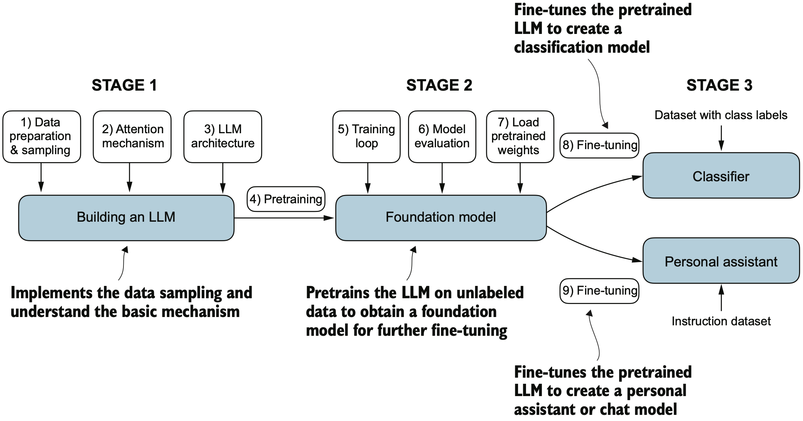

# Building and Fine-Tuning a GPT-2 Style LLM

**Semester Project @ EPFL - "Code Your Own LLM"**
*Based on Sebastian Raschka’s **Build a Large Language Model from Scratch***

---
## Project Overview

This repository is an educational project that implements a working GPT-2 style Large Language Model (LLM) **from scratch**. Developed as a semester-long independent project at EPFL, it follows the methodology of Raschka’s textbook to combine theoretical understanding with practical skills. The result is a functioning LLM-based system built from raw components, demonstrating how modern transformer-based models can be constructed and fine-tuned for specific tasks.

Key goals of the project included:

* **Deep Understanding:** Gain a deep understanding of transformer-based language models by coding a GPT-2 style model from scratch in PyTorch.
* **Pretrained Model Interaction:** Learn to load and use real GPT-2 pretrained weights and generate coherent text completions from them.
* **Fine-Tune for Classification:** Fine-tune the base GPT-2 model on a **binary classification** task (spam vs. ham email detection) to adapt it for supervised learning.
* **Fine-Tune for Instructions:** Fine-tune the base model on an **instruction-following** dataset to make it respond to prompts in a task-oriented way (mimicking an assistant or ChatGPT-like behavior).
* **Modular Codebase:** Design a modular, professional-quality codebase to enable easy experimentation, extension, and clarity of implementation.

This project bridges theory and practice - it starts from first principles of LLM architecture and culminates in fine-tuned models for real applications. The diagram below outlines the **three main stages** involved in building an LLM from scratch, which correspond to the progression of this project:

<p align="center">


&#x20;*Figure 1: **Stages of Building an LLM from Scratch.** Stage 1 implements the core LLM **architecture** and data preprocessing pipeline. Stage 2 pre-trains the LLM on unlabeled text to obtain a **foundation model**. Stage 3 fine-tunes the model on a downstream task, creating (for example) a text **classifier** or an instruction-following assistant. Image retrieved from Raschka's Book.*
</p>

---

## Table of Contents

* [Building the GPT-2 Model from Scratch: Concepts and Architecture](#building-the-gpt-2-model-from-scratch-concepts-and-architecture)
* [Repository Structure](#repository-structure)
* [Setup Instructions](#setup-instructions)
* [Running the Pretrained GPT-2 Model](#running-the-pretrained-gpt-2-model)
* [Running the Fine-Tuned Spam Classifier](#running-the-fine-tuned-spam-classifier)
* [Running the Fine-Tuned Instruction Model](#running-the-fine-tuned-instruction-model)
* [Base Model Design and Key Components](#base-model-design-and-key-components)
* [Fine-Tuning for Classification](#fine-tuning-for-classification)
* [Fine-Tuning for Instruction Following](#fine-tuning-for-instruction-following)
* [Plots and Outputs](#plots-and-outputs)
* [Acknowledgments](#acknowledgments)
* [References](#references)
* [License](#license)

---

## Building the GPT-2 Model from Scratch: Concepts and Architecture

This section outlines how a GPT-2-style large language model is implemented **from the ground up** in this project. The implementation closely follows the architectural and conceptual guidelines from Raschka’s *Build a Large Language Model from Scratch*, with a focus on modularity, clarity, and educational value. The goal is to make it clear how each component of a transformer-based language model works, how they fit together, and how they enable text generation via autoregressive modeling.

<p align="center">


&#x20;*Figure 2: **GPT-2 Model Architecture (Decoder-Only Transformer).** The GPT-2 architecture consists solely of the decoder stack from the original Transformer design, featuring multiple layers of masked self-attention and feed-forward networks. Each token in the input sequence attends only to previous tokens (unidirectional, left-to-right), enabling the model to generate text in an autoregressive manner—predicting one token at a time based on prior context. This structure is fundamental to GPT-2’s ability to produce coherent and contextually relevant text completions.  
Image retrieved from GeeksForGeeks: [Introduction to Generative Pre-trained Transformer (GPT)](https://www.geeksforgeeks.org/artificial-intelligence/introduction-to-generative-pre-trained-transformer-gpt/).*
</p>

---
### Step-by-Step Overview of the GPT-2 Architecture

The GPT-2 model is a decoder-only Transformer, designed to predict the next token in a sequence given all previous tokens. Here’s how the model is structured and implemented in this project:

#### 1. Tokenization

The first step in working with text is to convert it into numerical form:

* The GPT-2 Byte Pair Encoding (BPE) tokenizer (via OpenAI’s `tiktoken` library) is used to tokenize input text.
* Input text is split into subword units and mapped to integer token IDs.
* These token IDs are then fed into the model’s embedding layer.

*Relevant code:* `helpers.py`, `dataloader.py`

#### 2. Embedding Layer

Two types of embeddings are added to each token position in the input sequence:

* **Token Embeddings:** Each token ID is converted into a dense vector representation (learned embedding).
* **Positional Embeddings:** A learned positional vector is added to each token embedding to inject information about token position in the sequence. GPT-2 uses *learnable* positional embeddings (in contrast to sinusoidal positions).

*Relevant code:* `model.py`

#### 3. Stacked Transformer Decoder Blocks

The model contains a stack of identical Transformer decoder blocks, each composed of:

* **Masked Multi-Head Self-Attention:** Each token attends only to previous tokens (using a causal mask). Attention is computed across multiple “heads” in parallel, allowing the model to focus on different aspects of the context.
* **Feed-Forward Network:** A two-layer fully connected network (with a non-linear activation, e.g. GELU, in between) applied to each position.
* **Residual Connections & Layer Normalization:** Residual skip-connections around the attention and feed-forward sub-layers, combined with layer normalization, to stabilize training deeper networks.

These blocks are repeated *n\_layers* times to form the full Transformer. For example, GPT-2 Small has 12 layers, GPT-2 Medium has 24 layers, etc.

*Relevant code:* `attention.py`, `model.py`

#### 4. Output Projection

After the stack of Transformer blocks:

* The final representations are normalized (layer norm) and fed into a linear output layer (projection).
* The output dimension is the size of the vocabulary. Each position’s output vector produces a score for every possible next token.
* During training, a softmax and cross-entropy loss are applied to these scores to measure how well the model predicted the actual next token.

*Relevant code:* `model.py`

#### 5. Training Objective (Next-Token Prediction)

During training, the model learns by predicting the next token for every position in a sequence:

* Given a sequence of tokens `w₁, w₂, ..., wₙ`, the model is trained to predict token `wᵢ` from all previous tokens `w₁ ... wᵢ₋₁`.
* **Causal language modeling (next-word prediction)** is used: the prediction for each position only depends on earlier positions (unidirectional context).
* Loss is computed as the cross-entropy between the model’s predicted distribution for the next token and the actual next token. The total training loss is the average across all token positions in the sequence. The model is trained to minimize this loss across the entire sequence.

*Relevant code:* `helpers.py`, `train.py`

---
### Pretraining Objective: Autoregressive Language Modeling

The model is trained from scratch using an autoregressive next-token prediction objective (also known as causal language modeling):

> **Autoregressive training:** Given a sequence of tokens `[w₁, w₂, w₃, ..., wₙ]`, for each position *i* the model learns to predict `wᵢ` based on `[w₁, w₂, ..., wᵢ₋₁]`.

Unlike bidirectional models (e.g. BERT), GPT-style models are strictly unidirectional - they never “see” future tokens during training or inference. This training scheme enables the model to generate text by sampling one token at a time and feeding its output back in as the next input.

---
### Architectural Details

This project supports multiple GPT-2 model sizes via `config.py`. Two configurations are primarily used:

| **Model Variant** | **Layers** | **Hidden Size** | **Attention Heads** | **Parameters** |
| ----------------- | ---------: | --------------: | ------------------: | -------------: |
| GPT-2 Small       |         12 |             768 |                  12 |  \~124 million |
| GPT-2 Medium      |         24 |            1024 |                  16 |  \~355 million |

*(Larger GPT-2 variants (Large, XL) follow the same architecture with increased depth/width.)* These configurations align with the original OpenAI GPT-2 model specifications and can be selected depending on the task and available compute.

---

### Generation Process

Once the model is trained (or loaded with pretrained weights), it can generate text autogressively:

1. **Prompt:** The user provides a prompt, e.g. *“The future of AI is”*.
2. **Tokenization:** The prompt is tokenized into IDs and fed into the model.
3. **Next Token Prediction:** The model outputs a probability distribution over the vocabulary for the next token. One token is sampled (or the highest-probability token is chosen) and appended to the sequence.
4. **Iterate:** The updated sequence (original prompt + new token) is fed back into the model to predict the following token. This loop continues until a stopping condition is met (e.g. a special end-of-sequence token or a set length).

The generated output text will continue the input prompt in a coherent way, reflecting the patterns learned during training. (For example, given the prompt above, the model might continue with a speculative sentence about AI.)

*Relevant code:* `helpers.py`, `run_pretrained_model.py`

---
### Why Build an LLM from Scratch?

Most modern NLP workflows use pre-built transformer models (often via libraries like Hugging Face). However, implementing an LLM from scratch has significant educational value and practical benefits:

* It reveals how core components like attention mechanisms, embeddings, and layer normalization work together internally.
* It allows full control over model architecture and training, which is useful for debugging and experimentation.
* It builds intuition for how and why certain design choices (causal masking, residual connections, etc.) are made.
* It lays a foundation for extending the model - for instance, adding new capabilities through fine-tuning - with a deeper understanding of the implications.

This solid foundation made it possible to later extend the base model for **spam classification** and **instruction-following**, as described in later sections of this report.

---

## Repository Structure

```
my-llm/
│
├── base_model/                  # Core GPT model components
│   ├── attention.py             # Multi-head self-attention mechanism implementation
│   ├── config.py                # Configuration presets for different GPT-2 model sizes
│   ├── dataloader.py            # Utilities for dataset preparation and loading
│   ├── gpt_download.py          # Functions to download/load pretrained GPT-2 weights
│   ├── helpers.py               # Tokenization, text generation, and loss calculation utilities
│   ├── model.py                 # Definition of the full GPT-2 model architecture
│   └── train.py                 # Basic training loop for pretraining from scratch
│
├── classification/              # Fine-tuning GPT-2 for spam classification
│   ├── data.py                  # Download and prepare SMS Spam dataset
│   ├── dataloader.py            # Dataset and DataLoader for spam data
│   ├── model_setup.py           # Setup GPT-2 with a classification head
│   ├── training.py              # Fine-tuning training loop (spam classification)
│   ├── plotting.py              # Plot loss and accuracy curves during training
│   └── run_classification_model.py  # Script to run fine-tuning and interact with classifier
│
├── instruction/                 # Fine-tuning GPT-2 for instruction-following tasks
│   ├── data.py                  # Download and prepare instruction-following dataset
│   ├── dataloader.py            # DataLoader utilities for instruction fine-tuning
│   ├── model_setup.py           # Prepare GPT-2 with adjustments for instruction fine-tuning
│   ├── training.py              # Fine-tuning training loop for instruction following
│   ├── plotting.py              # Plot loss curves for instruction fine-tuning
│   └── run_instruction_model.py # Script to run fine-tuning and evaluate instruction model
│
├── run_pretrained_model.py      # Run the pretrained GPT-2 model interactively (text generation)
├── README.md                    # Project documentation (this file)
├── requirements.txt             # Python package requirements
└── LICENSE                      # Stating what this code can be used for, etc.
```

---

## Setup Instructions

1. **Python Environment:** Install Python 3.10+ and ensure you have a suitable environment (virtualenv, Conda, etc.).
2. **Install Dependencies:** Install the required libraries:

   ```bash
   pip install torch tiktoken numpy pandas matplotlib tqdm
   ```

   *Note:* To **load and use the original GPT-2 pretrained weights** (for `run_pretrained_model.py`), you will also need to install **TensorFlow** (used to read OpenAI’s TensorFlow checkpoint format):

   ```bash
   pip install tensorflow
   ```

   TensorFlow is only needed for loading the official GPT-2 weights. You do not need TensorFlow for training or fine-tuning tasks (those use PyTorch).

---

## Running the Pretrained GPT-2 Model

This repository provides a script to load OpenAI’s **GPT-2 Small (124M)** pretrained weights and generate text interactively. This allows testing the architecture with a real pretrained model before any fine-tuning.

**To run the pretrained model interactively:**

```bash
python -m my_llm.run_pretrained_model
```

You will be prompted to enter text and the model will complete it. For example:

```
Enter a prompt (type 'quit' to exit):
The future of AI is
```

And the model might output:

```
The future of AI is also bound towards its possible and potentially future goals 
of replacing humanity with highly human intelligent animals, but so far there 
may not seem obvious paths...
```

Since this is the base GPT-2 model without task-specific fine-tuning, it will continue the prompt in a plausible way based on patterns in the web-scale data it was trained on. The output may be coherent in a general sense but not necessarily factual or specific to any domain.

### How It Works Under the Hood

* **Model Architecture:** The script initializes the GPT-2 model architecture (using the `GPTModel` class) with the specified size (by default, GPT-2 Small \~124M parameters).
* **Tokenization:** It uses GPT-2’s BPE tokenizer (`tiktoken`) to encode the input prompt into tokens that the model can process.
* **Loading Weights:** Pretrained weights are downloaded and loaded from OpenAI’s published GPT-2 checkpoint (originally in TensorFlow format) into our PyTorch model.
* **Text Generation:** The model generates text via greedy decoding by default (optionally top-k sampling or temperature scaling could be used). It predicts one token at a time and appends it to the prompt, iterating until a stop condition or length limit.

---

## Base Model Design and Key Components

The base GPT-2 model (in `base_model/`) is implemented in a modular fashion. Key files and their roles include:

| File              | Description                                                                                                                                           |
| ----------------- | ----------------------------------------------------------------------------------------------------------------------------------------------------- |
| `attention.py`    | Implements the **MultiHeadAttention** class for scaled dot-product multi-head attention, including causal masking for autoregressive behavior.        |
| `config.py`       | Defines model configuration dataclasses for various GPT-2 sizes (small, medium, large, XL), specifying layer counts, hidden dimensions, etc.          |
| `dataloader.py`   | Provides dataset loading and batching utilities (e.g., preparing text for training or loading pretrained weight files).                               |
| `gpt_download.py` | Utility to download GPT-2 checkpoint files and convert them to the PyTorch model’s state dict format.                                                 |
| `helpers.py`      | Utility functions for tokenization (using `tiktoken`), text generation (e.g., `generate` function), and loss calculation across model outputs.        |
| `model.py`        | Defines the **GPTModel** class - including token & positional embeddings, the Transformer decoder blocks, and the final output projection.            |
| `train.py`        | Provides a simple training loop (e.g., `train_model_simple`) to pretrain or fine-tune the model, including periodic evaluation and sample generation. |

Important classes and functions in the base model include:

* **`GPTModel`** (in `model.py`): Combines all components to create the full Transformer decoder model. Handles forward pass: token + positional embedding, sequential application of Transformer blocks, and output logits computation.
* **`MultiHeadAttention`** (in `attention.py`): Implements multi-head self-attention with query, key, value projections and attention output projection. Supports masking to prevent future tokens from being seen.
* **`FeedForward`** (in `model.py`): A two-layer feed-forward network used inside each Transformer block (with GELU activation and dropout). Processes each token position independently after attention.
* **`generate`** (in `helpers.py`): Function to generate text from the model given an input context. It loops by calling the model to predict the next token and appending it, with options for randomness (sampling) or greedy output.
* **`train_model_simple`** (in `train.py`): A basic training loop that takes a model, optimizer, and data loaders to train the model. It also supports periodic evaluation on validation data and can generate sample text outputs during training to monitor progress.
* **Loss calculation utilities** (`calc_loss_batch` and `calc_loss_loader` in `helpers.py`): Functions to compute the cross-entropy loss given model outputs and target tokens, for a single batch or an entire dataset loader.

---

## Fine-Tuning for Classification

Following the pretraining of the base model (or loading of a pretrained foundation model), the next step was to fine-tune the LLM for a binary text classification task. In this project, we fine-tuned the GPT-2 model to distinguish between **spam** and **ham** (non-spam) messages. This use-case demonstrates how a generative language model can be adapted for a supervised classification task with relatively few modifications.

### Overview

For the spam classification task, fine-tuning is done by:

* **Adding a Classification Head:** GPT-2’s original output layer (which produces a distribution over vocabulary tokens) is replaced with a simple linear layer that outputs a two-dimensional vector (for "ham" vs "spam"). This is essentially treating the final Transformer block’s output as features for classification.
* **Dataset Preparation:** Using the [SMS Spam Collection Data](https://archive.ics.uci.edu/ml/datasets/SMS+Spam+Collection) (a corpus of text messages labeled as spam or ham). The dataset is balanced and split into training/validation/test sets.
* **Training Procedure:** Training the model on this labeled dataset using a standard cross-entropy loss for binary classification. The model’s weights are initialized from a pretrained GPT-2 (for language modeling) and then fine-tuned on the classification data.
* **Saving Outputs:** After fine-tuning, the model checkpoint and training curves (loss and accuracy plots) are saved for evaluation and reuse.

The fine-tuning code is modular, organized into distinct steps for data preparation, model setup, training, evaluation, and inference - mirroring best practices for machine learning projects.

### Repository Structure (Classification Fine-Tuning)

```
classification/
│
├── data.py              # Downloads and processes the SMS Spam Collection dataset
├── dataloader.py        # Defines a SpamDataset and DataLoader for batching text messages
├── model_setup.py       # Loads the base GPT-2 model and attaches a classification head
├── training.py          # Fine-tunes the model on the spam dataset (training loop with eval)
├── evaluation.py        # Functions to calculate accuracy and loss on a dataset
├── inference.py         # Utility to classify new texts using the trained model
├── plotting.py          # Generates plots for training/validation loss and accuracy
└── run_classification_model.py  # Main script to run the entire fine-tuning process and interactive testing
```

### How the Classification Fine-Tuning Works

The classification fine-tuning process involves several components and stages:

* **Dataset Preparation** (`data.py`):
  Downloads the SMS Spam Collection dataset and preprocesses it. The data is balanced (ensuring equal spam and ham examples) and then split into Training (70%), Validation (10%), and Test (20%) sets. The processed datasets are saved as CSV files for reuse.

* **Dataloader** (`dataloader.py`):
  Implements a `SpamDataset` class (subclassing PyTorch `Dataset`) which tokenizes each message using the GPT-2 tokenizer (`tiktoken`). Messages are padded to a fixed length for batching. A PyTorch `DataLoader` is used for efficient batching and shuffling during training.

* **Model Setup** (`model_setup.py`):
  Loads a base GPT-2 model (with pretrained weights for language modeling). Most of the GPT-2 layers are frozen (kept unmodified during training) to preserve the language modeling capability. A new linear classification head is added on top of the model (in place of GPT-2’s usual next-token predictor). In this project, only the final Transformer block and the new classifier layer are trainable (the rest of the network remains fixed).

* **Training Loop** (`training.py`):
  Implements supervised training for the classification task using PyTorch. It uses **cross-entropy loss** on the two-class output. The training runs for a small number of epochs (since the dataset is not large). After every `eval_freq` steps, it evaluates the model on validation data to monitor loss and accuracy. Training uses the AdamW optimizer with a low learning rate (e.g. 5e-5) to avoid overwriting the pretrained weights.

* **Evaluation** (`evaluation.py`):
  Provides helper functions like `calc_accuracy_loader` to compute accuracy over a DataLoader, and similarly `calc_loss_batch` / `calc_loss_loader` for computing loss. These are used after training to evaluate performance on the test set.

* **Inference** (`inference.py`):
  After training, this module allows easy use of the model for prediction. For example, a function `classify_review(text, model, ...)` returns "spam" or "not spam" for a given input text using the trained model and tokenizer.

* **Plotting** (`plotting.py`):
  Uses Matplotlib to plot training and validation loss/accuracy curves. This helps in visualizing the fine-tuning progress (e.g., to detect overfitting or convergence). Plots are saved to the `classification/plots/` directory.

### Running the Fine-Tuned Spam Classifier

Once the model is fine-tuned for spam detection, you can run the provided script to interactively test the classifier or retrain if needed. Ensure you have installed the required packages (as listed above) before running.

**To train or load the spam classifier model:**

```bash
python -m my_llm.classification.run_classification_model
```

This script will automatically download the dataset (if not already present) and start fine-tuning the model. By default, it will **load an existing trained model** if `my_llm/classification/review_classifier.pth` is found (to avoid re-training every time). Set `LOAD_EXISTING = False` in the script or remove the file to force retraining. During execution, it will:

* **Data preparation & tokenization:** Download and preprocess the dataset, then load it into DataLoader objects.
* **Model loading & training:** Initialize the model (with GPT-2 weights and a new classifier head). If a saved checkpoint exists, it loads it; otherwise, it fine-tunes the model from scratch on the spam data. Training progress (loss/accuracy) will be periodically evaluated.
* **Model saving:** After training, the fine-tuned model weights are saved to `classification/review_classifier.pth`. Training curves are saved as `classification/plots/loss_plot.pdf` and `accuracy_plot.pdf`.
* **Interactive prompt:** Once training (or loading) is complete, the script enters an interactive loop where you can type in a message and get a prediction.

For example, an interactive session might look like:

```
Model ready on cpu. Type a review to classify it, or 'quit' to exit.

Review> Hey, just wanted to check if we're still on for dinner tonight? Let me know!
→ Predicted label: not spam

Review> You are a winner! You have been selected to receive $1000 cash or a $2000 award.
→ Predicted label: spam

Review> quit
Exiting classifier.
```

Here, the model correctly identifies the first message as not spam (ham) and the second as spam. Thanks to the fine-tuning, the model has learned to pick up on telltale signs of spam messages (unusual promises, promotional language, etc.) despite being originally a generative model.

**Saved outputs:** After running, you will find a saved model checkpoint at `my_llm/classification/review_classifier.pth`. Training metrics are plotted and saved to `my_llm/classification/plots/` (e.g. `loss_plot.pdf` and `accuracy_plot.pdf`), so you can inspect the learning curves.

#### Programmatic Inference Example

Instead of using the interactive prompt, you can also use the fine-tuned model in a script or notebook. For example:

```python
from my_llm.classification.inference import classify_review

# (Assume `model`, `tokenizer`, and `device` have been loaded as in run_classification_model.py)
text = "You have won a free iPhone!"
label = classify_review(text, model, tokenizer, device, max_length=train_dataset.max_length)
print(label)  # Expected output: "spam"
```

You can feed any string into `classify_review` and get a classification result. For instance:

| Text                               | Prediction     |
| ---------------------------------- | -------------- |
| "Hey, are we still meeting today?" | Not spam  |
| "WIN a FREE vacation and $1000 now!!!"       | Spam         |


#### Notes on this Fine-Tuned Model

* The fine-tuned spam classifier is relatively small and efficient. It inherits the 124M parameter GPT-2 backbone, but since most weights were frozen, it effectively trains only a subset of those parameters plus a small new head. This makes it feasible to train on a single GPU or even CPU for a few epochs.
* Because it was fine-tuned on a specific (and limited) dataset, its vocabulary and language understanding are inherited from GPT-2, but its classification capability is narrow (just spam vs ham). For any serious deployment or a different classification task, one would likely need a larger dataset and possibly adjust which layers to fine-tune.
* The approach demonstrates that **pretrained LLMs can be adapted** to classification tasks with minimal changes. Even though GPT-2 was not originally designed for classification, using its rich language representations allows decent performance on this task.

---

## Instruction Fine-Tuning (Instruction-Following Task)

The next part of the project explores **instruction fine-tuning** - training the model to follow structured instructions and produce helpful responses. This process is similar in spirit to how models like **InstructGPT** are tuned to be more responsive and aligned with user prompts. The goal here is to adapt the GPT-2 model (355M variant for this part) to perform tasks given in natural language instructions, rather than just continuing text.

In essence, we want the model to function more like a conversational assistant: not only generating text, but doing so in direct response to a user’s request or question.

### Overview

The instruction fine-tuning pipeline works as follows:

* **Instruction Dataset:** We utilize a dataset of example instructions and ideal responses (see `instruction-data.json`). This dataset consists of data like:
{
        "instruction": "Evaluate the following phrase by transforming it into the spelling given.",
        "input": "freind --> friend",
        "output": "The spelling of the given phrase \"freind\" is incorrect, the correct spelling is \"friend\"."
    }
* **Fine-Tune GPT-2:** The base GPT-2 model (with \~355M parameters for a bit more capacity) is fine-tuned on this dataset of instruction-response pairs. The training objective is still next-token prediction, but formatted in a way that the model learns to produce the correct response when given an instruction prompt.
* **Validation/Evaluation:** After fine-tuning, the model’s outputs on held-out instructions are evaluated. Optionally, an external reference model (like a powerful language model via an API or local server) is used to score the responses for quality.

The key idea is to guide the model to follow prompts more explicitly, making it behave more like an AI assistant. This is a crucial step in going from a raw language model to something like ChatGPT.

### Repository Structure (Instruction Fine-Tuning)

```
instruction/
│
├── data.py             # Downloads the instruction-following dataset and prepares training/validation/test splits
├── dataloader.py       # Creates batches for training, handling padding and masking for instruction/response format
├── model_setup.py      # Loads the GPT-2 model and prepares it for instruction fine-tuning (e.g., adjusting context)
├── training.py         # Training loop for instruction fine-tuning (similar to classification training)
├── ollama_evaluation.py# (Optional) utilities to evaluate responses using an external LLM (e.g., via Ollama server)
├── run_instruction_model.py  # Main script that orchestrates the fine-tuning and evaluation process
└── plotting.py         # Creates plots for the training loss curve (if needed)
```

### Key Components and Design

* **Formatted Prompts:** To train the model to follow instructions, each training example is structured in a specific prompt format. For instance:

  ```
  Below is an instruction that describes a task. Write a response that appropriately completes the request.

  ### Instruction:
  [Task description]

  ### Input:
  [Optional additional input]

  ### Response:
  [Model's expected response]
  ```

  All training examples are formatted similarly, so the model learns to recognize the *Instruction* and *Response* sections. During inference, we provide an instruction in the same format and have the model generate the response after the prompt.

* **Custom Collation & Loss Masking:** The dataloader uses a custom `collate_fn` to dynamically pad and concatenate the instruction and response into one sequence. Importantly, it also creates a **loss mask** so that the loss is only computed on the **response** portion of the sequence (the model should not be penalized for simply repeating the instruction as given). This ensures the model focuses on producing a correct response.

* **Fine-Tuning Strategy:** We fine-tune using a small learning rate (e.g. 5e-5 with AdamW optimizer) for a few epochs. Only a few epochs are needed to make the model learn the instruction-following behavior, since the dataset is small and we want to avoid overfitting or destroying the base language abilities. We did not freeze any layers here; all model weights update, but the small learning rate minimizes forgetting.

* **Saving Outputs:** All final artifacts are saved: the fine-tuned model checkpoint (e.g. `gpt2-medium-355M-sft.pth`), and a JSON file containing a record of each test instruction along with the model’s generated response (for evaluation purposes). Training loss curves can also be saved to the `instruction/plots/` directory.

* **External Evaluation (Ollama):** For a quantitative sense of performance, a script is included to interface with an external language model (such as a LLaMA-based model running via an Ollama server). This script sends the instruction, the expected reference answer, and the model’s answer to the external model, which returns a score (0-100) evaluating how well the model’s answer meets the instruction. This kind of evaluation is not common in standard academic practice but can provide a rough automatic metric of alignment or quality.

### Why Instruction Fine-Tuning?

While base language models (like GPT-2) can generate text, they do not inherently know how to follow explicit instructions. Fine-tuning on instruction-response data teaches the model to:

* **Follow Structured Prompts:** It learns the pattern that when given a prompt formatted as an instruction, it should produce an appropriate response rather than a continuation.
* **Generalize to New Tasks:** The model sees examples of various tasks (answering questions, transforming text, etc.), which helps it respond to types of instructions it hasn’t seen before. It develops a rudimentary ability to act like a conversational assistant.
* **Alignment with User Intent:** By training on high-quality responses, the model’s outputs become more aligned with what a user might consider a helpful answer, rather than the more raw or unfocused completions a base model might give.

Instruction fine-tuning is an essential step toward building useful AI assistants and chatbots. It bridges the gap between pretraining (learning to predict text in general) and **reinforcement fine-tuning** (which further aligns a model with human preferences). In our case, we focus only on the supervised fine-tuning stage to demonstrate the core concept.

---

### Running the Fine-Tuned Instruction Model

To run the fine-tuning for instructions (or to use a pre-fine-tuned model), use the provided script:

```bash
python -m my_llm.instruction.run_instruction_model
```

This script will perform the following steps (if not already done):

1. **Dataset Download:** It will fetch the instruction dataset and prepare it. The dataset consists of prompts with instructions (and optional inputs) along with target responses.
2. **Load Pretrained Model:** It loads the GPT-2 Medium (355M parameter) model weights as the starting point.
3. **Fine-Tune:** The model is fine-tuned on the instruction-following dataset. Progress is printed, and a loss curve may be plotted.
4. **Save Checkpoint:** After training, the fine-tuned model is saved as `instruction/gpt2-medium-355M-sft.pth`.
5. **Generate Responses:** The script then uses the fine-tuned model to generate responses for all test set instructions, saving them (along with the prompts and reference answers) into `instruction/instruction-data-with-response.json`.
6. **(Optional) Evaluate with Ollama:** If an Ollama server with an external model is running (and the `ollama_evaluation.py` is configured), the script will request scores for each generated response to gauge quality.

**Note:** If you run the script again, by default it will **load the existing fine-tuned model** (to avoid retraining). You can force retraining by setting the `LOAD_EXISTING_MODEL = False` in the script or removing the saved model file. Make sure you have an Ollama server set up if you want the external evaluation step to work (the script will skip or error out if it cannot connect to the server).

#### Example Outputs after Fine-Tuning

After two epochs of instruction fine-tuning, the model was tested on some unseen instructions from the test set. Below are a couple of examples of the model’s behavior:

---

**Instruction:**
*“Rewrite the sentence using a simile.”*
*The car is very fast.*

**Model Response:**
*“The car is as fast as a bullet.”*

---

**Instruction:**
*“Name the author of 'Pride and Prejudice'.”*

**Model Response:**
*“The author of 'Pride and Prejudice' is Jane Austen.”*

---

In these cases, the fine-tuned model clearly follows the instruction: it rewrote a sentence with a simile in the first example, and answered a factual question directly in the second. This is a notable improvement over the base GPT-2 model, which might have just continued the prompt or given a generic completion rather than directly addressing the instruction.

#### Quantitative Evaluation (Ollama Scoring)

To quantitatively evaluate the instruction-following performance, the fine-tuned model’s responses were scored by an external LLM (via an Ollama local server running a large model). Each response was given a score from 0 to 100 based on how well it satisfied the instruction.

**Evaluation summary:**

* **Number of test prompts evaluated:** 110
* **Average score (0-100):** \~48.2/100

These scores indicate that while the model learned to follow instructions to an extent (nearly half-way to a perfect score on average), there is plenty of room for improvement. Keep in mind that this is a relatively small model fine-tuned on a limited dataset, so an average score around 48 is a reasonable outcome for a laptop-trained model. Larger models or more extensive fine-tuning (including human feedback tuning) would likely achieve higher scores on the same evaluation.

---

## Results and Evaluation

**Overall, this project successfully demonstrates:**

* How to build a GPT-2 style Transformer model from scratch using PyTorch, illustrating the core concepts of the architecture.
* Loading real-world GPT-2 pretrained weights and generating text, confirming that the implemented model is compatible with official checkpoints.
* Fine-tuning the model for two distinct downstream tasks: binary classification (spam detection) and instruction-following text generation. In both cases, the base model’s capabilities are repurposed effectively through relatively lightweight fine-tuning.
* The importance of careful formatting and objective design when fine-tuning (e.g., how instruction prompts are structured, or how only certain layers are trained for classification).
* A clean, modular codebase that can be a starting point for further experiments (such as trying larger models, different tasks, or integrating newer techniques like LoRA or RLHF).

By replicating and extending key concepts from Sebastian Raschka’s book, this project provides a hands-on illustration of LLM development. It shows that with the right approach, even a single individual (with modest computing resources) can create a mini GPT-like model, tailor it to specific tasks, and evaluate its performance using both qualitative examples and quantitative metrics.

Finally, leveraging tools like an external LLM for evaluation (Ollama in this case) hints at modern methodologies to benchmark model outputs when traditional metrics are hard to define. This kind of approach can be useful in academic and educational settings to get quick feedback on model behavior.

---

## Plots and Outputs

Throughout training and fine-tuning, various plots and output artifacts are produced for analysis:

* **Training Curves:** During both spam classification and instruction fine-tuning, the training script saves plots of the training and validation loss (and accuracy, for classification) over time. These plots (saved as PNG in the respective `plots/` directories) help visualize convergence and detect any overfitting. For instance, one can observe the loss decreasing and flattening out after a couple of epochs, indicating sufficient training.
* **Model Checkpoints:** After fine-tuning, the model weights are saved (e.g., `classification/review_classifier.pth` for the spam classifier, `instruction/gpt2-medium-355M-sft.pth` for the instruction model). These can be loaded to skip training steps or to deploy the models.
* **Generated Outputs:** Example outputs from the fine-tuned models are documented in this README (see the sections above). Additionally, the instruction fine-tuning script saves a JSON file containing all test instructions with the model’s generated responses, which can be inspected or used for further evaluation.
* **Interactive Demos:** The interactive prompt shown for the spam classifier and the examples for the instruction model serve as qualitative evaluations, demonstrating the behavior change achieved by fine-tuning. They provide concrete evidence of the model’s capabilities (e.g., correctly classifying messages, properly answering questions) after each fine-tuning stage.

These outputs collectively show the progress and results of the project. They confirm that the model learned the intended tasks to a reasonable degree. For instance, the spam classifier’s accuracy on the test set and the instruction model’s example responses both validate that the approach worked, while the plots provide insight into the training dynamics.

---

## Acknowledgments

Special thanks to **Sebastian Raschka** for the excellent book *Build a Large Language Model from Scratch*, which served as a primary reference and inspiration for this project’s structure and methodology. The project also benefited from:

* **OpenAI** - for releasing the GPT-2 model weights to the public, enabling educational projects like this to incorporate real pretrained models.
* **Hugging Face** - for the `tiktoken` tokenizer implementation and generally fostering an open-source NLP ecosystem.
* **EPFL Supervisors** - Yousra El-Bachir and Oleg Bakhteev, for their guidance and feedback throughout the semester project.

## References

1. **Raschka, Sebastian. (2025).** *Build a Large Language Model (From Scratch)*. Manning Publications.
2. **Radford, Alec et al. (2019).** *Language Models Are Unsupervised Multitask Learners*. OpenAI (GPT-2 Technical Report).
3. **Ouyang, Long et al. (2022).** *Training Language Models to Follow Instructions with Human Feedback*. NeurIPS 2022 (InstructGPT).

## License

This project is released for educational and research purposes. All custom code in this repository is made available under an open license (see the `LICENSE` file) for others to learn from and build upon.

Note that the pretrained GPT-2 weights used here are subject to OpenAI’s usage policies. If you use the GPT-2 model weights, make sure to adhere to the OpenAI [Model Usage Guidelines](https://openai.com/research/openai-api).

Any data and model outputs from this project are intended for demonstration only. **Use responsibly and at your own risk.** The authors are not liable for any misuse of the provided code or models.
